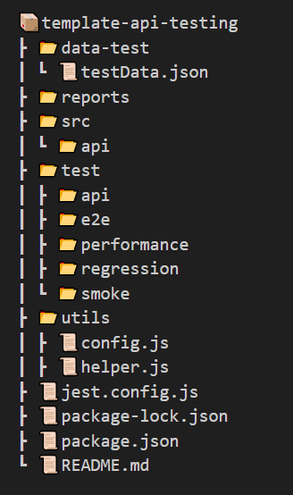
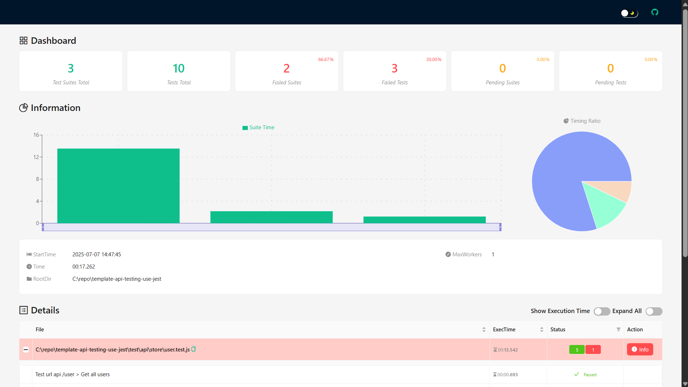

<!-- PROJECT LOGO -->
<br />
<p align="center">
  <a href="https://github.com/fredysiswanto/">
    
  </a>
</p>

<h3 align="center">Testing API with Jest + Supertest</h3>

<p align="center">
   A simple and extensible template for API testing using <strong>Jest</strong> and <strong>Supertest</strong>. <br/>
  Ideal for quick setup and custom automation scripting.
</p>

---

## About the Project

This repository provides a ready-to-use template for testing RESTful APIs using:

- [Jest](https://jestjs.io/docs/)
- [Jest Extended](https://jest-extended.jestcommunity.dev/docs/matchers/)
- [Supertest](https://github.com/ladjs/supertest#readme)
- [Fake Store API](https://fakestoreapi.com/) for sample data

## Directory Structure



## Usage

### Run all tests

```bash
pnpm run test
```

### Generate starter testing files

```bash
node scripts/cli <file-name or api-name> --test --api
```

- `--test`: Generate a sample testing file (placed under `test/`)
- `--api`: Generate an API helper function file (placed under `src/api/`)

Example:

```bash
node scripts/cli product --test --api
```

Will create:

- `test/product.test.js`
- `src/api/product.js`

Example Test Report:



## How to Write Your API Tests

Check out this [YouTube Demo Playlist](https://www.youtube.com/playlist?list=PLm2QKf1dhlBAZ2MUieV2sAV5-Vdvl-ICh)

---

## Getting Started

### Prerequisites

Make sure you have **Node.js** and **npm** installed:

```bash
node -v
pnpm -v
```

### Clone the Repository

```bash
git clone https://github.com/fredysiswanto/template-api-testing-use-jest.git
cd template-api-testing-use-jest
```

### Install Dependencies

```bash
pnpm install
```

You're ready to start writing tests!

---

## License

Distributed under the MIT License. See [`LICENSE`](LICENSE) for more information.

---

## Contributing

Contributions are welcome! Feel free to open issues or submit pull requests to improve the template.
